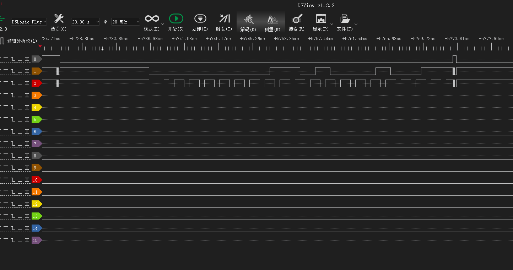

# OOO_Custom_Coin_Flasher

The code and SCH for custom OOO nfc flasher which uses NTAG213 for coins...

### About the custom coin

Just add a text record which includes the coin's binary id, and it's done~

### About low power consumption

The rp2040 is not an best option, so I changed to ESP32C3, but as I want to sell the custom flasher PCBA, the codes for esp32c3 and the pcb will NOT be open-sourced.

### ⚠About RP2040 SDK bugs

The rp2040 sdk I used has some [issues ](https://github.com/raspberrypi/pico-sdk/issues/1453)when print logs in multicore,  they said this has been fixed but I have not tested... So take the codes as a POC....

### The medal ring

I'm also working on the medal ring, still testing and will upload that to [MakerWorld](https://makerworld.com/zh/models/580491), Do not print that now as I am still waiting for the package..... so no guarantee about the shapes now...

### Why

The original coin's pcb is SOOOO ugly.... and the protocol of the coin is kind of 💩...

And this days RFID chips like rc522 is soooo cheap! So there's no reason to use that anymore!!!

### How

With some small research, and use a logic analyser, We can easily find that the 3pins(ABLEN, DATA, CLOCK) works like this:



The ABLEN is pulled down when the scanner is flashing, and when the nfc flasher find a coin, it will send the coin's id with the DATA lan and CLOCK lan.

Like the table below, the coin's id is converted to binary. each 0/1 in clock lan is 600us long.

```
                       Start bits         |      Coin ID (162 in dec)     | End bits
                                          | 1   0   1   0   0   0   1   0 |
DATA:   0   0   0   0   0   0   0   0   1 | 1   0   1   0   0   0   1   0 | 0   1   1
CLOCK: 000 101 101 101 101 101 101 101 101 101 101 101 101 101 101 101 101 101 101 101
```

So with this we can easily made our own custom nfc flasher boards with rc522 or other nfc chips.

### The coin ids

The table below is from this site [ライダーメダル レアいろいろ](http://blog.livedoor.jp/q_yu627/archives/32513553.html), and I added the binary data for each coin so you can write that to ntag213 easily. (BTW I haven't learn Japanese so plz use google translate.....)

| ID 	| Bin 	| メダル名 	| CSM版 	| DX版 	|
|---	|---	|---	|---	|---	|
| 1 	| 00000001 	| クワガタ 	| クワガタ(緑) 	|  	|
| 2 	| 00000010 	| カマキリ 	| カマキリ(緑) 	|  	|
| 3 	| 00000011 	| バッタ 	| バッタ(緑) 	|  	|
| 4 	| 00000100 	| ライオン 	| ライオン(黄色) 	|  	|
| 5 	| 00000101 	| トラ 	| トラ(黄色) 	|  	|
| 6 	| 00000110 	| チーター 	| チーター(黄色) 	|  	|
| 7 	| 00000111 	| サイ 	| サイ(白) 	|  	|
| 8 	| 00001000 	| ゴリラ 	| ゴリラ(白) 	|  	|
| 9 	| 00001001 	| ゾウ 	| ゾウ(白) 	|  	|
| 10 	| 00001010 	| タカ 	| タカ(赤) 	|  	|
| 11 	| 00001011 	| クジャク 	| クジャク(赤) 	|  	|
| 12 	| 00001100 	| コンドル 	| コンドル(赤) 	|  	|
| 13 	| 00001101 	| シャチ 	| シャチ(青) 	|  	|
| 14 	| 00001110 	| 電気ウナギ 	| ウナギ(青) 	|  	|
| 15 	| 00001111 	| タコ 	| タコ(青) 	|  	|
| 16 	| 00010000 	| プテラ 	| プテラ(紫) 	|  	|
| 17 	| 00010001 	| トリケラ 	| トリケラ(紫) 	|  	|
| 18 	| 00010010 	| ティラノ 	| ティラノ(紫) 	|  	|
| 19 	| 00010011 	| コブラ 	| コブラ(オレンジ) 	|  	|
| 20 	| 00010100 	| カメ 	| カメ(オレンジ) 	|  	|
| 21 	| 00010101 	| ワニ 	| ワニ(オレンジ) 	|  	|
| 22 	| 00010110 	| ヤドカリ 	| ヤドカリ(水色) 	|  	|
| 23 	| 00010111 	| カニ 	| カニ(水色) 	|  	|
| 24 	| 00011000 	| エビ 	| エビ(水色) 	|  	|
| 25 	| 00011001 	| セイウチ 	| セイウチ(白) 	| セイウチ(水色) 	|
| 26 	| 00011010 	| シロクマ 	| シロクマ(白) 	| シロクマ(水色) 	|
| 27 	| 00011011 	| ペンギン 	| ペンギン(青) 	| ペンギン(水色) 	|
| 28 	| 00011100 	| サソリ 	| サソリ(水色) 	|  	|
| 29 	| 00011101 	| ハチ 	| ハチ(黄色) 	| ハチ(水色) 	|
| 30 	| 00011110 	| ムカデ 	| ムカデ(紫) 	| ムカデ(水色) 	|
| 31 	| 00011111 	| シカ 	| シカ(オレンジ) 	| シカ(水色) 	|
| 32 	| 00100000 	| ウシ 	| ウシ(白) 	| ウシ(水色) 	|
| 33 	| 00100001 	| ガゼル 	| ガゼル(オレンジ) 	| ガゼル(水色) 	|
| 34 	| 00100010 	| パンダ 	| パンダ(白) 	| パンダ(水色) 	|
| 35 	| 00100011 	| カンガルー 	| カンガルー(オレンジ) 	| カンガルー(水色) 	|
| 36 	| 00100100 	| アリ 	| アリ(白) 	| アリ(水色) 	|
| 37 	| 00100101 	| クワガタ・セル 	| クワガタ・ギン(水色) 	|  	|
| 38 	| 00100110 	| カマキリ・セル 	| カマキリ・ギン(水色) 	|  	|
| 39 	| 00100111 	| バッタ・セル 	| バッタ・ギン(水色) 	|  	|
| 40 	| 00101000 	| ライオン・セル 	| ライオン・ギン(水色) 	|  	|
| 41 	| 00101001 	| トラ・セル 	| トラ・ギン(水色) 	|  	|
| 42 	| 00101010 	| チーター・セル 	| チーター・ギン(水色) 	|  	|
| 43 	| 00101011 	| サイ・セル 	| サイ・ギン(水色) 	|  	|
| 44 	| 00101100 	| ゴリラ・セル 	| ゴリラ・ギン(水色) 	|  	|
| 45 	| 00101101 	| ゾウ・セル 	| ゾウ・ギン(水色) 	|  	|
| 46 	| 00101110 	| タカ・セル 	| タカ・ギン(水色) 	|  	|
| 47 	| 00101111 	| クジャク・セル 	| クジャク・ギン(水色) 	|  	|
| 48 	| 00110000 	| コンドル・セル 	| コンドル・ギン(水色) 	|  	|
| 49 	| 00110001 	| シャチ・セル 	| シャチ・ギン(水色) 	|  	|
| 50 	| 00110010 	| 電気ウナギ・セル 	| ウナギ・ギン(水色) 	|  	|
| 51 	| 00110011 	| タコ・セル 	| タコ・ギン(水色) 	|  	|
| 52 	| 00110100 	| プテラ・セル 	| プテラ・ギン(水色) 	|  	|
| 53 	| 00110101 	| トリケラ・セル 	| トリケラ・ギン(水色) 	|  	|
| 54 	| 00110110 	| ティラノ・セル 	| ティラノ・ギン(水色) 	|  	|
| 55 	| 00110111 	| コブラ・セル 	| コブラ・ギン(水色) 	|  	|
| 56 	| 00111000 	| カメ・セル 	| カメ・ギン(水色) 	|  	|
| 57 	| 00111001 	| ワニ・セル 	| ワニ・ギン(水色) 	|  	|
| 58 	| 00111010 	|  	| ※不明 	| ヤドカリ・ギン(水色) 	|
| 59 	| 00111011 	| カニ・セル 	| カニ・ギン(水色) 	|  	|
| 60 	| 00111100 	| エビ・セル 	| エビ・ギン(水色) 	|  	|
| 61 	| 00111101 	|  	| ※不明 	| セイウチ・ギン(水色) 	|
| 62 	| 00111110 	|  	| ※不明 	| シロクマ・ギン(水色) 	|
| 63 	| 00111111 	|  	| ※不明 	| ペンギン・ギン(水色) 	|
| 64 	| 01000000 	| サソリ・セル 	| サソリ・ギン(水色) 	|  	|
| 65 	| 01000001 	|  	| ※不明 	| ハチ・ギン(水色) 	|
| 66 	| 01000010 	|  	| ※不明 	| ムカデ・ギン(水色) 	|
| 67 	| 01000011 	|  	| ※不明 	| シカ・ギン(水色) 	|
| 68 	| 01000100 	|  	| ※不明 	| ウシ・ギン(水色) 	|
| 69 	| 01000101 	|  	| ※不明 	| ガゼル・ギン(水色) 	|
| 70 	| 01000110 	|  	| ※不明 	| パンダ・ギン(水色) 	|
| 71 	| 01000111 	|  	| ※不明 	| カンガルー・ギン(水色) 	|
| 72 	| 01001000 	|  	| ※不明 	| アリ・ギン(水色) 	|
| 73 	| 01001001 	| 新1号（カプセル版） 	| 仮面ライダー(緑) 	| 仮面ライダー(水色) 	|
| 74 	| 01001010 	| スカルクリスタル 	| 仮面ライダー(白) 	| 仮面ライダー(水色) 	|
| 75 	| 01001011 	| V3 	| 仮面ライダー(緑) 	| 仮面ライダー(水色) 	|
| 76 	| 01001100 	|  	| ※不明 	| 仮面ライダー(水色) 	|
| 77 	| 01001101 	| X 	| X(白) 	| 仮面ライダー(水色) 	|
| 78 	| 01001110 	| アマゾン ※1 	| アマゾン(緑) 	| 仮面ライダー(水色) 	|
| 79 	| 01001111 	| ZX 	| 仮面ライダー(赤) 	| 仮面ライダー(水色) 	|
| 80 	| 01010000 	| ストロンガー 	| ストロンガー(赤) 	| 仮面ライダー(水色) 	|
| 81 	| 01010001 	| アクセルブースター 	| 仮面ライダー(黄色) 	| 仮面ライダー(水色) 	|
| 82 	| 01010010 	| BLACK RX 	| 仮面ライダー(緑) 	| 仮面ライダー(水色) 	|
| 83 	| 01010011 	| BLACK 	| 仮面ライダー(緑) 	| 仮面ライダー(水色) 	|
| 84 	| 01010100 	| W ヒートメタル 	| ダブル （白→赤） 	| 仮面ライダー(水色) 	|
| 85 	| 01010101 	| W ルナトリガー 	| ダブル （黄色→青） 	| 仮面ライダー(水色) 	|
| 86 	| 01010110 	| W ファングジョーカー （カプセル4版） 	| ダブル （白→紫） 	| 仮面ライダー(水色) 	|
| 87 	| 01010111 	| アクセル 	| 仮面ライダー(赤) 	| 仮面ライダー(水色) 	|
| 88 	| 01011000 	| 新2号 	| 仮面ライダー(緑) 	| 仮面ライダー(水色) 	|
| 89 	| 01011001 	| クウガ 	| クウガ(赤) 	| クウガ(水色) 	|
| 90 	| 01011010 	| アギト 	| アギト(黄色) 	| アギト(水色) 	|
| 91 	| 01011011 	|  	| ※不明 	| 龍騎(水色) 	|
| 92 	| 01011100 	| ファイズ ブラスターフォーム 	| ファイズ(赤) 	| ファイズ(水色) 	|
| 93 	| 01011101 	| ブレイド 	| ブレイド(青) 	| ブレイド(水色) 	|
| 94 	| 01011110 	| 響鬼 	| 響鬼(紫) 	| 響鬼(水色) 	|
| 95 	| 01011111 	| カブト 	| カブト(赤) 	| カブト(水色) 	|
| 96 	| 01100000 	| 電王（食玩・EX版） 	| 電王(赤) 	| 電王(水色) 	|
| 97 	| 01100001 	| キバ エンペラーフォーム 	| キバ(黄色) 	| キバ(水色) 	|
| 98 	| 01100010 	| ディケイド 	| ディケイド(ピンク) 	| ディケイド(水色) 	|
| 99 	| 01100011 	| W サイクロンジョーカー 	| ダブル（緑→紫） 	| ダブル(水色) 	|
| 100 	| 01100100 	| イマジン モモタロスイマジン ※1 	| イマジン(赤) 	| イマジン(水色) 	|
| 101 	| 01100101 	| キンタロスイマジン 	| イマジン(黄色) 	| イマジン(水色) 	|
| 102 	| 01100110 	| リュウタロスイマジン 	| イマジン(紫) 	| イマジン(水色) 	|
| 103 	| 01100111 	| ネガタロスイマジン 	| イマジン(赤) 	| イマジン(水色) 	|
| 104 	| 01101000 	| ゼロノス ゼロフォーム 	| 仮面ライダー(赤) 	| ライダーメダル(水色) 	|
| 105 	| 01101001 	| ゼロノス アルタイルフォーム 	| 仮面ライダー(緑) 	| ライダーメダル(水色) 	|
| 106 	| 01101010 	| ディエンド コンプリートフォーム 	| 仮面ライダー(水色) 	| ライダーメダル(水色) 	|
| 107 	| 01101011 	| ディケイド コンプリートフォーム SP 	| ディケイド(ピンク) 	| ガンバライド(水色) 	|
| 108 	| 01101100 	| 新1号（付録版） 	| 仮面ライダー(緑) 	| ガンバライド(水色) 	|
| 109 	| 01101101 	| デンライナー SP 	| 電王(赤) 	| ガンバライド(水色) 	|
| 110 	| 01101110 	| スカル 	| 仮面ライダー(白) 	| ガンバライド(水色) 	|
| 111 	| 01101111 	| 11ライダー SP 	| 仮面ライダー(緑) 	| ガンバライド(水色) 	|
| 112 	| 01110000 	| ディケイド 激情態 	| ディケイド(ピンク) 	| ダークライダー(水色) 	|
| 113 	| 01110001 	| イクサ セーブモード 	| 仮面ライダー(白) 	| ライダーメダル(水色) 	|
| 114 	| 01110010 	| イクサ バーストモード 	| 仮面ライダー(白) 	| ライダーメダル(水色) 	|
| 115 	| 01110011 	|  	| （無反応） 	| てれびくん(水色) 	|
| 116 	| 01110100 	|  	| （無反応） 	| テレビマガジン(水色) 	|
| 117 	| 01110101 	| アギト トリニティフォーム 	| アギト(黄色) 	| ライダーメダル(水色) 	|
| 118 	| 01110110 	| アギト バーニングフォーム 	| アギト(赤) 	| ライダーメダル(水色) 	|
| 119 	| 01110111 	| ヒビ割れたタカ 	| タカ（アンクボイス）(赤) 	| ライダーメダル(水色) 	|
| 120 	| 01111000 	| スーパータカ 	| スーパータカ(赤) 	| ライダーメダル(水色) 	|
| 121 	| 01111001 	| スーパートラ 	| スーパートラ(黄色) 	| ライダーメダル(水色) 	|
| 122 	| 01111010 	| スーパーバッタ 	| スーパーバッタ(緑) 	| ライダーメダル(水色) 	|
| 123 	| 01111011 	| サメ 	| サメ(水色) 	| ライダーメダル(水色) 	|
| 124 	| 01111100 	| クジラ 	| クジラ(青) 	| ライダーメダル(水色) 	|
| 125 	| 01111101 	| オオカミウオ 	| オオカミウオ(赤) 	| ライダーメダル(水色) 	|
| 126 	| 01111110 	| （オーズドライバー・変身/スキャニングチャージ用） 	|  	|  	|
| 127 	| 01111111 	| （メダジャリバー・スキャニングチャージ用） 	|  	|  	|
| 128 	| 10000000 	| （タジャスピナー・ギガスキャン用） 	|  	|  	|
| 129 	| 10000001 	| （認識なし） 	|  	|  	|
| 130 	| 10000010 	| （認識なし） 	|  	|  	|
| 131 	| 10000011 	| クワガタ（カプセル版） 	| クワガタ(緑) 	|  	|
| 132 	| 10000100 	| カマキリ（カプセル版） 	| カマキリ(緑) 	|  	|
| 133 	| 10000101 	| バッタ（カプセル版） 	| バッタ(緑) 	|  	|
| 134 	| 10000110 	| ライオン（カプセル版） 	| ライオン(黄色) 	|  	|
| 135 	| 10000111 	| トラ（カプセル版） 	| トラ(黄色) 	|  	|
| 136 	| 10001000 	| チーター（カプセル版） 	| チーター(黄色) 	|  	|
| 137 	| 10001001 	| サイ（カプセル版） 	| サイ(白) 	|  	|
| 138 	| 10001010 	| ゴリラ（カプセル版） 	| ゴリラ(白) 	|  	|
| 139 	| 10001011 	| ゾウ（カプセル版） 	| ゾウ(白) 	|  	|
| 140 	| 10001100 	| タカ（カプセル版） 	| タカ(赤) 	|  	|
| 141 	| 10001101 	| クジャク（カプセル版） 	| クジャク(赤) 	|  	|
| 142 	| 10001110 	| コンドル（カプセル版） 	| コンドル(赤) 	|  	|
| 143 	| 10001111 	| シャチ（カプセル版） 	| シャチ(青) 	|  	|
| 144 	| 10010000 	| 電気ウナギ（カプセル版） 	| ウナギ(青) 	|  	|
| 145 	| 10010001 	| タコ（カプセル版） 	| タコ(青) 	|  	|
| 146 	| 10010010 	| プテラ（カプセル版） 	| プテラ(紫) 	|  	|
| 147 	| 10010011 	| トリケラ（カプセル版） 	| トリケラ(紫) 	|  	|
| 148 	| 10010100 	| ティラノ（カプセル版） 	| ティラノ(紫) 	|  	|
| 149 	| 10010101 	| クワガタ（食玩版） 	| クワガタ(緑) 	|  	|
| 150 	| 10010110 	| カマキリ（食玩版） 	| カマキリ(緑) 	|  	|
| 151 	| 10010111 	| バッタ（食玩版） 	| バッタ(緑) 	|  	|
| 152 	| 10011000 	| ライオン（食玩版） 	| ライオン(黄色) 	|  	|
| 153 	| 10011001 	| トラ（食玩版） 	| トラ(黄色) 	|  	|
| 154 	| 10011010 	| チーター（食玩版） 	| チーター(黄色) 	|  	|
| 155 	| 10011011 	| サイ（食玩版） 	| サイ(白) 	|  	|
| 156 	| 10011100 	| ゴリラ（食玩版） 	| ゴリラ(白) 	|  	|
| 157 	| 10011101 	| ゾウ（食玩版） 	| ゾウ(白) 	|  	|
| 158 	| 10011110 	| タカ（食玩版） 	| タカ(赤) 	|  	|
| 159 	| 10011111 	| クジャク（食玩版） 	| クジャク(赤) 	|  	|
| 160 	| 10100000 	| コンドル（食玩版） 	| コンドル(赤) 	|  	|
| 161 	| 10100001 	| シャチ（食玩版） 	| シャチ(青) 	|  	|
| 162 	| 10100010 	| 電気ウナギ（食玩版） 	| ウナギ(青) 	|  	|
| 163 	| 10100011 	| タコ（食玩版） 	| タコ(青) 	|  	|
| 164 	| 10100100 	| プテラ（食玩版） 	| プテラ(紫) 	|  	|
| 165 	| 10100101 	| トリケラ（食玩版） 	| トリケラ(紫) 	|  	|
| 166 	| 10100110 	| ティラノ（食玩版） 	| ティラノ(紫) 	|  	|
| 167 	| 10100111 	| クウガ ライジングアルティメット （レッドアイ） 	| クウガ(黄色) 	| クウガ(水色) 	|
| 168 	| 10101000 	|  	| ※不明 	| クウガ(水色) 	|
| 169 	| 10101001 	|  	| ※不明 	| アギト(水色) 	|
| 170 	| 10101010 	|  	| ※不明 	| アギト(水色) 	|
| 171 	| 10101011 	| 龍騎 	| 龍騎(赤) 	| 龍騎(水色) 	|
| 172 	| 10101100 	| ファイズ 	| ファイズ(赤) 	| ファイズ(水色) 	|
| 173 	| 10101101 	| ファイズ アクセルフォーム 	| ファイズ(赤) 	| ファイズ(水色) 	|
| 174 	| 10101110 	| ブレイド キングフォーム 	| ブレイド(黄色) 	| ブレイド(水色) 	|
| 175 	| 10101111 	|  	| ※不明 	| 響鬼(水色) 	|
| 176 	| 10110000 	|  	| ※不明 	| 響鬼(水色) 	|
| 177 	| 10110001 	| カブト ハイパーフォーム 	| カブト(水色) 	|  	|
| 178 	| 10110010 	|  	| ※不明 	| 電王(水色) 	|
| 179 	| 10110011 	|  	| ※不明 	| 電王(水色) 	|
| 180 	| 10110100 	| 電王（カプセル版） 	| 電王(赤) 	| 電王(水色) 	|
| 181 	| 10110101 	| 電王 ウイングフォーム 	| 電王(白) 	| 電王(水色) 	|
| 182 	| 10110110 	| 電王 ライナーフォーム 	| 電王(赤) 	| 電王(水色) 	|
| 183 	| 10110111 	| 電王 超クライマックスフォーム 	| 電王(赤) 	| 電王(水色) 	|
| 184 	| 10111000 	| NEW電王 	| 電王(青) 	| 電王(水色) 	|
| 185 	| 10111001 	| ウラタロスイマジン 	| イマジン(青) 	| イマジン(水色) 	|
| 186 	| 10111010 	|  	| ※不明 	| イマジン(水色) 	|
| 187 	| 10111011 	|  	| ※不明 	| イマジン(水色) 	|
| 188 	| 10111100 	|  	| ※不明 	| イマジン(水色) 	|
| 189 	| 10111101 	| キバ 	| キバ(赤) 	| キバ(水色) 	|
| 190 	| 10111110 	| ディケイド コンプリートフォーム 	| ディケイド(ピンク) 	| ディケイド(水色) 	|
| 191 	| 10111111 	| W サイクロンジョーカー  ゴールドエクストリーム 	| ダブル(黄色) 	| ダブル(水色) 	|
| 192 	| 11000000 	| W ファングジョーカー （カプセル3版） 	| ダブル （白→紫） 	| ダブル(水色) 	|
| 193 	| 11000001 	|  	| ※不明 	| ダブル(水色) 	|
| 194 	| 11000010 	| W サイクロンジョーカー  エクストリーム 	| ダブル(白) 	| ダブル(水色) 	|
| 195 	| 11000011 	| リュウガ 	| ダークライダー(赤) 	| ダークライダー(水色) 	|
| 196 	| 11000100 	| ダークカブト 	| ダークライダー(赤) 	| ダークライダー(水色) 	|
| 197 	| 11000101 	| クウガ ライジングアルティメット （ブラックアイ） 	| クウガ(黄色) 	| ダークライダー(水色) 	|
| 198 	| 11000110 	| ネガ電王 	| ダークライダー(赤) 	| ダークライダー(水色) 	|
| 199 	| 11000111 	| エターナル 	| ダークライダー(白) 	| ダークライダー(水色) 	|
| 200 	| 11001000 	| ショッカーライダー1号 	| ダークライダー(黄色) 	| ダークライダー(水色) 	|
| 201 	| 11001001 	| W＆ハードボイルダー 	| ダブル（緑→紫） 	| ガンバライド(水色) 	|
| 202 	| 11001010 	| W ジョーカービッグスリッパー 	| ダブル（緑→紫） 	| ガンバライド(水色) 	|
| 203 	| 11001011 	| スカル＆スカルボイルダー 	| 仮面ライダー(白) 	| ガンバライド(水色) 	|
| 204 	| 11001100 	| 新1号＆新サイクロン号 	| 仮面ライダー(緑) 	| ガンバライド(水色) 	|
| 205 	| 11001101 	| トリプルエクストリーム 	| 仮面ライダー(ピンク) 	| ガンバライド(水色) 	|
| 206 	| 11001110 	| シャドームーン 	| ダークライダー(白) 	| ガンバライド(水色) 	|
| 207 	| 11001111 	| ショッカー 	| ショッカー(黄色) 	| ガンバライド(水色) 	|
| 208 	| 11010000 	| エビ（新造） 	| エビ(赤) 	| ガンバライド(水色) 	|
| 209 	| 11010001 	| カニ（新造） 	| カニ(紫) 	| ガンバライド(水色) 	|
| 210 	| 11010010 	| サソリ（新造） 	| サソリ(紫) 	| ガンバライド(水色) 	|
| 211 	| 11010011 	| クワガタ（財団X製） 	| クワガタ(緑) 	| ガンバライド(水色) 	|
| 212 	| 11010100 	| カマキリ（財団X製） 	| カマキリ(緑) 	| ガンバライド(水色) 	|
| 213 	| 11010101 	| バッタ（財団X製） 	| バッタ(緑) 	| ガンバライド(水色) 	|
| 214 	| 11010110 	| ライオン（財団X製） 	| ライオン(黄色) 	| ガンバライド(水色) 	|
| 215 	| 11010111 	| トラ（財団X製） 	| トラ(黄色) 	| ガンバライド(水色) 	|
| 216 	| 11011000 	| チーター（財団X製） 	| チーター(黄色) 	| ガンバライド(水色) 	|
| 217 	| 11011001 	| サイ（財団X製） 	| サイ(白) 	| ガンバライド(水色) 	|
| 218 	| 11011010 	| ゴリラ（財団X製） 	| ゴリラ(白) 	| ガンバライド(水色) 	|
| 219 	| 11011011 	| ゾウ（財団X製） 	| ゾウ(白) 	| ガンバライド(水色) 	|
| 220 	| 11011100 	| タカ（財団X製） 	| タカ(赤) 	| ガンバライド(水色) 	|
| 221 	| 11011101 	| クジャク（財団X製） 	| クジャク(赤) 	| ライダーメダル(水色) 	|
| 222 	| 11011110 	| コンドル（財団X製） 	| コンドル(赤) 	| ライダーメダル(水色) 	|
| 223 	| 11011111 	| シャチ（財団X製） 	| シャチ(青) 	| ライダーメダル(水色) 	|
| 224 	| 11100000 	| ウナギ（財団X製） 	| ウナギ(青) 	| ライダーメダル(水色) 	|
| 225 	| 11100001 	| タコ（財団X製） 	| タコ(青) 	| ライダーメダル(水色) 	|
| 226 	| 11100010 	|  	| ※不明 	| ライダーメダル(水色) 	|
| 227 	| 11100011 	| アクセルトライアル 	| 仮面ライダー(青) 	| ライダーメダル(水色) 	|
| 228 	| 11100100 	| ジョーカー 	| 仮面ライダー(紫) 	| ライダーメダル(水色) 	|
| 229 	| 11100101 	|  	| プテラ(紫) 	| ライダーメダル(水色) 	|
| 230 	| 11100110 	|  	| トリケラ(紫) 	| ライダーメダル(水色) 	|
| 231 	| 11100111 	|  	| ティラノ(紫) 	| ライダーメダル(水色) 	|
| 232 	| 11101000 	|  	| コブラ(オレンジ) ※2 	| ライダーメダル(水色) 	|
| 233 	| 11101001 	|  	| カメ(オレンジ) ※2 	| ライダーメダル(水色) 	|
| 234 	| 11101010 	|  	| ワニ(オレンジ) ※2 	| ライダーメダル(水色) 	|
| 235 	| 11101011 	|  	| ※不明 	| ライダーメダル(水色) 	|
| 236 	| 11101100 	|  	| ※不明 	| ライダーメダル(水色) 	|
| 237 	| 11101101 	|  	| ※不明 	| ライダーメダル(水色) 	|
| 238 	| 11101110 	|  	| ※不明 	| ライダーメダル(水色) 	|
| 239 	| 11101111 	|  	| ※不明 	| ライダーメダル(水色) 	|
| 240 	| 11110000 	|  	| ※不明 	| ライダーメダル(水色) 	|
| 241 	| 11110001 	|  	| ※不明 	| ライダーメダル(水色) 	|
| 242 	| 11110010 	|  	| ※不明 	| ライダーメダル(水色) 	|
| 243 	| 11110011 	|  	| ※不明 	| ライダーメダル(水色) 	|
| 244 	| 11110100 	|  	| ※不明 	| ライダーメダル(水色) 	|
| 245 	| 11110101 	|  	| ※不明 	| ライダーメダル(水色) 	|
| 246 	| 11110110 	|  	| ※不明 	| ライダーメダル(水色) 	|
| 247 	| 11110111 	|  	| ※不明 	| ライダーメダル(水色) 	|
| 248 	| 11111000 	|  	| ※不明 	| ライダーメダル(水色) 	|
| 249 	| 11111001 	|  	| ※不明 	| ライダーメダル(水色) 	|
| 250 	| 11111010 	|  	| ※不明 	| ライダーメダル(水色) 	|
| 251 	| 11111011 	|  	| ※不明 	| ライダーメダル(水色) 	|
| 252 	| 11111100 	|  	| ※不明 	| ライダーメダル(水色) 	|
| 253 	| 11111101 	|  	| ※不明 	| ライダーメダル(水色) 	|
| 254 	| 11111110 	|  	| ※不明 	| ライダーメダル(水色) 	|
| 255 	| 11111111 	|  	| ※不明 	| ライダーメダル(水色) 	|
